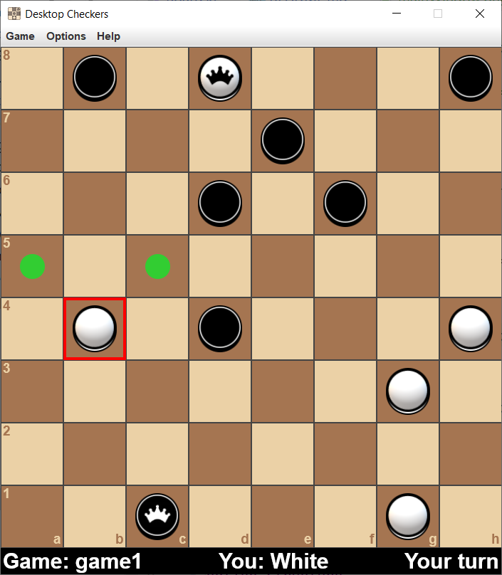
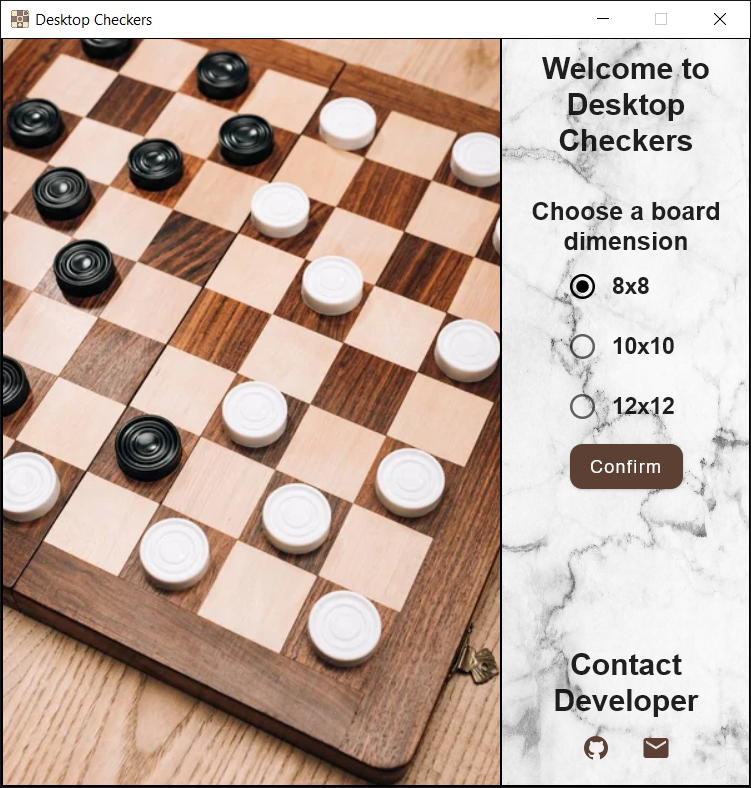
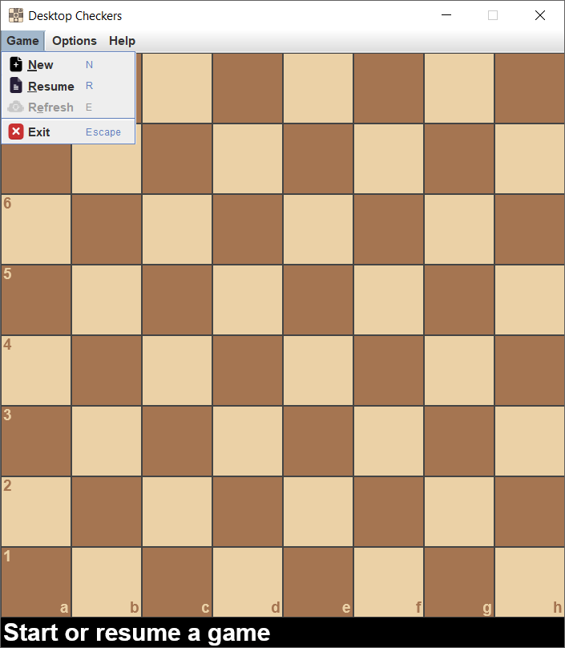
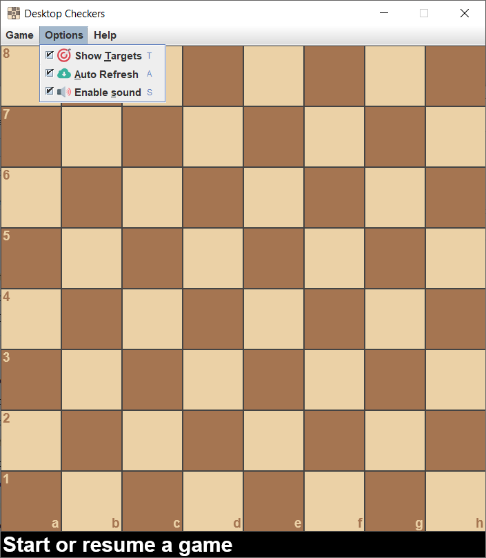
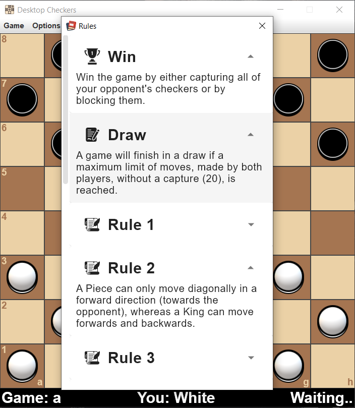
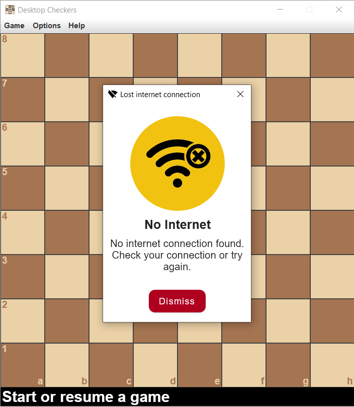
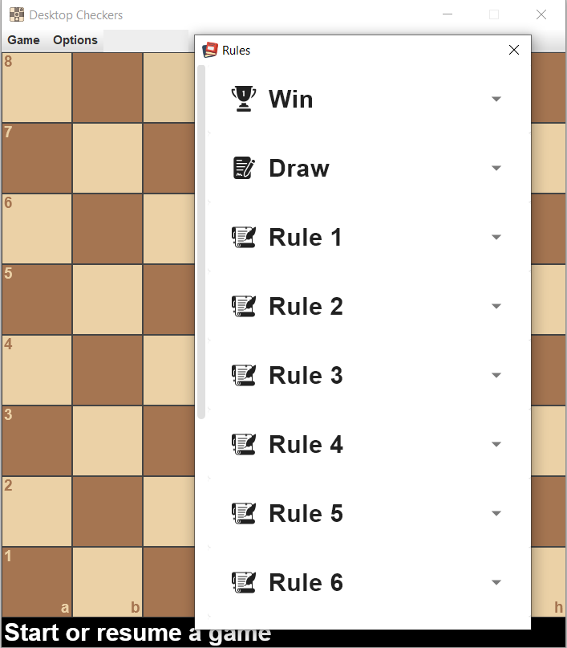

# Desktop Checkers App

This application serves as a game interface where users are invited to play the classic [Checkers](https://www.britannica.com/topic/checkers) board game in an online environment against other players. 

The game is using the [Desktop Compose](https://www.jetbrains.com/lp/compose-desktop/) UI framework, and the data is stored in the [Mongo Database](https://www.mongodb.com/).

The whole project was a key evaluation point of the Software Development Techniques (TDS) course in the [CSE](https://www.isel.pt/en/curso/bsc-degree/computer-science-and-computer-engineering) undergraduate program of [ISEL](https://www.isel.pt/en).

## Table of Contents
- [Download](#download)
- [Features](#features)
- [Requirements](#requirements)
- [Initial Window](#initial-window)
- [Main Window](#main-window)
  - [Start a game](#start-a-game)
  - [Joining a game](#joining-a-game)
  - [Options](#options)
  - [Help](#help)
- [Internet Connection](#internet-connection)
- [Application Structure](#application-structure)
- [Known Bugs](#known-bugs)

## Download

Download the JAR file [here](https://mega.nz/file/5GpG3LrK#e0I4yjhDDsNj45_AxlLVxpehSy7IwglpS49Y_kI3TPA).

## Features
- [X] Checker unique images
- [X] Sound effects
- [X] Expressive dialog windows
- [X] Switch between automatic and manual refresh of the game screen

## Requirements
- JRE 1.4.0 or above (for running the application)
- JDK 17 or above (for development purposes)

## Initial Window

When the program is launched, this is the initial window that appears which allows you to choose a board dimension from the list of the available options. At the bottom, there are a few shortcuts to contact the developer in order to report a bug, ask for future functionalities, or offer suggestions for improvement.

## Main Window
### Start a game

By accessing the ***Game Menu*** you can:
  - **Create a new game** by providing a game identifier of your choice.
  - **Resume a game** by using a previously created game identifier. 
  - **Manually refresh** the game interface. This option will only be enabled if it's not your turn.
  - **Exit the application**. This option will terminate the application and does not return to the [Initial Window](#initial-window). To create or resume a game in another board dimension, the application must be restarted.

### Joining a game
It is only possible to join a game that has already been started. Both ***New*** and ***Resume*** options work for this operation, although the former is not advised because:
- It will overwrite the game data if more than one move has been made. 
- if the first player to enter tries to rejoin a game while the second player already joined, it will take his turn instead.

### Options

By accessing the ***Options Menu*** you can toggle:
 - [x] **Show Targets** - shows small circles where a play can be made if a checker is previously selected. 
 - [x] **Auto Refresh** - automatically refreshes the game when a play is performed by the other player. If this option is disabled the only way to refresh the game is manually, and can be selected in the *Game Menu*.
 - [x] **Sound** - adds sound effects to the game.

All options are enabled by default in order to provide a better user experience.

### Help

By accessing the ***Help Menu*** you can open the game rules, where a scrollable dialog window with several expandable cards will be shown.

If you're playing the game for the first time, it's advised that you read the rules first because [Checkers](https://en.wikipedia.org/wiki/Checkers) has a variety of rules that differ from region to region, and you might not be familiar with the ones used in this version.

## Internet Connection

Because the game was designed to be played solely online, it won't work correctly without a consistent internet connection. If a connection to the database could not be established, a dialog window, as seen in the above picture, will appear to alert for this issue.

## Application Structure
In the repository root, access <code>src/main/kotlin</code> where you can find the application structure which is divided in 5 major modules:
- **Checkers** - includes modules that are mainly exclusive to the *Checkers* game context. 
  - **model** - includes all types used to construct the game logic.
  - **storage** - includes a serializer specific of this game implementation along with the *MongoDB* access.
  - **ui** - includes both *console* (cmd) and *compose* UI implementations.
- **Composables** - includes all major generic composables used in the application.
- **Encryption** - includes the decrypt function but not the encrypt function as it's content was not considered relevant. 
- **File** - composes of all interfaces and classes that provides access to file operations such as read and write.
- **Storage** - includes all the interfaces and classes that allow the usage of different types of storage.

## Known bugs
### #1 - Menu option disappears

As the above image depicts, when a menu option opens a dialog window with a fixed height, that menu option disappears. The only workaround found was to set an unspecified height in the dialog state of the window or by manually resizing the window, but for this specific context it could not be used.
A similar [issue](https://github.com/JetBrains/compose-jb/issues/414) was discovered; however, as of this writing, there was no solution provided.

## Authors
- **Francisco Engenheiro** - 49428

---

Instituto Superior de Engenharia de Lisboa 
Software Development Techniques 
Winter Semester of 2022/2023